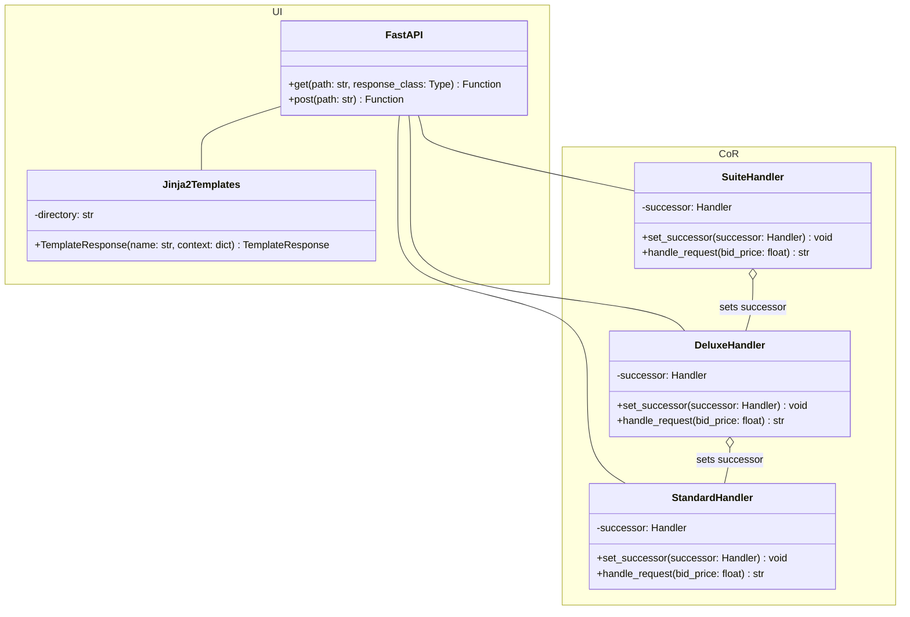

```mermaid
classDiagram
    FastAPI -- SuiteHandler
    FastAPI -- DeluxeHandler
    FastAPI -- StandardHandler
    FastAPI -- Jinja2Templates
    SuiteHandler o-- DeluxeHandler : sets successor
    DeluxeHandler o-- StandardHandler : sets successor
    namespace UI {
        class FastAPI{
            +get(path: str, response_class: Type) Function
            +post(path: str) Function
        }
        class Jinja2Templates{
            -directory: str
            +TemplateResponse(name: str, context: dict) TemplateResponse
        }
    }
    namespace CoR {
        class SuiteHandler{
            -successor: Handler
            +set_successor(successor: Handler) void
            +handle_request(bid_price: float) str
        }
        class DeluxeHandler{
            -successor: Handler
            +set_successor(successor: Handler) void
            +handle_request(bid_price: float) str
        }
        class StandardHandler{
            -successor: Handler
            +set_successor(successor: Handler) void
            +handle_request(bid_price: float) str
        }
    }
```
